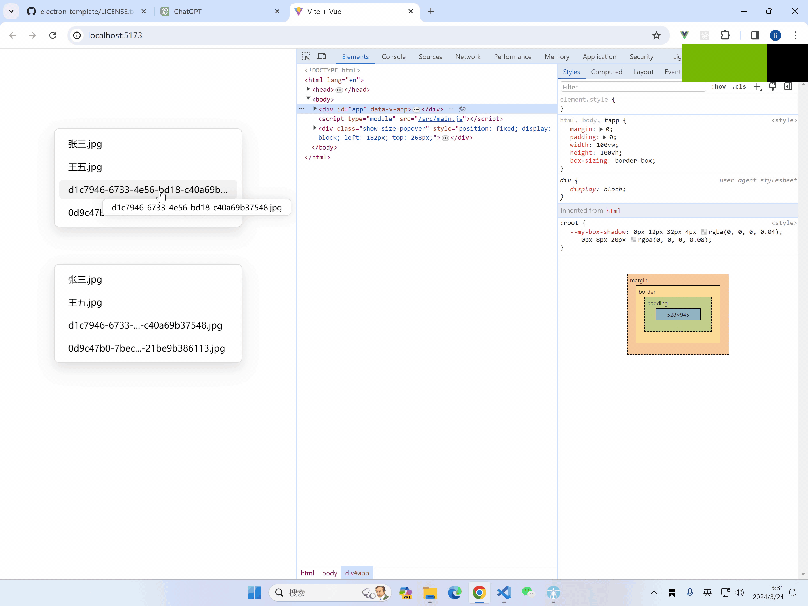

# Vue 3 自定义指令：文本调整与工具提示

本套件为 Vue 3 应用提供了两个自定义指令：`v-adjust-text`用于动态缩略文本以适应元素宽度，`v-my-tooltip`用于显示工具提示。这些指令提供了一种方便的方式来处理文本溢出和工具提示，仅需最少的设置。

## 功能

- **`v-adjust-text`**：如果文本溢出包含元素的宽度，则动态缩略文本。支持不同文件类型并自定义缩略过程。
- **`v-my-tooltip`**：为元素显示工具提示，支持自定义延迟和溢出检测。



## 安装

要在你的 Vue 3 项目中包含这些指令，请将指令代码复制到项目中。你可以为每个指令创建单独的文件（例如，`AdjustTextDirective.js`和`MyTooltipDirective.js`），并将它们放在项目的`directives`文件夹中。

## 使用方法

### v-adjust-text

`v-adjust-text`指令动态调整元素内的文本以确保它适应其边界，如有需要，可选地添加工具提示。

```javascript
import { vAdjustText } from "./directives/AdjustTextDirective";

app.directive("adjust-text", vAdjustText);
```

#### 示例：

```html
<div
  v-adjust-text="{ name: '某个可能需要缩略的非常长的文件名.txt', fileType: 1 }"
  style="width: 100px;"
></div>
```

### v-my-tooltip

`v-my-tooltip`指令允许你轻松为元素添加工具提示。它支持自定义延迟，并可以配置为仅在文本溢出元素时显示工具提示。

```javascript
import { vMyTooltip } from "./directives/MyTooltipDirective";

app.directive("my-tooltip", vMyTooltip);
```

#### 示例：

```html
<div v-my-tooltip="{ text: '这里是工具提示文本', delay: 300 }">悬停我</div>
```

## API

### v-adjust-text 绑定值

- `name`: 要显示并可能缩略的文本。
- `fileType`: 决定是否保留文件扩展名（例如，`1`为保留，`2`为不保留）。

### v-my-tooltip 绑定值

- `text`: 工具提示中显示的文本。
- `delay`: 显示工具提示前的延迟时间（毫秒）。
- `hidden`: 如果为 true，则不显示工具提示。

### 修饰符

- `text`: 表示工具提示应仅使用元素的文本。
- `overflow`: 工具提示只有在文本溢出元素边界时才显示。

## 贡献

欢迎贡献、问题和功能请求！请随时检查[问题页面](#)。

## 许可证

根据 MIT 许可证分发。查看`LICENSE`了解更多信息。

---
